# Landing Page Showcase

Coleção de **12 landing pages conceituais** criada para demonstrar repertório visual, hierarquia, responsividade e construção de páginas comerciais em diferentes nichos.

A proposta deste repositório é simples: cada exemplo segue uma direção visual própria. Nada de trocar apenas cor, título e imagem em um mesmo template.

## Exemplos

### 01 — Foco 21 · Low-ticket / produto digital

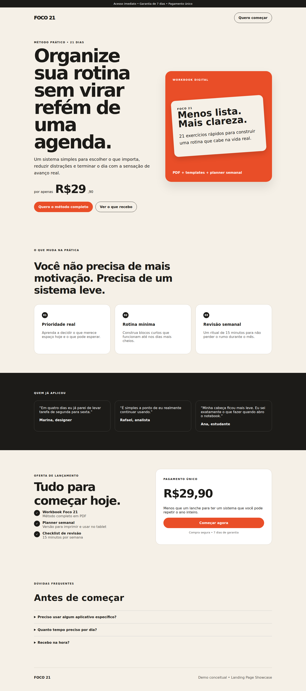

Arquivo: [`examples/low-ticket/index.html`](examples/low-ticket/index.html)

---

### 02 — Fala. · VSL / curso online

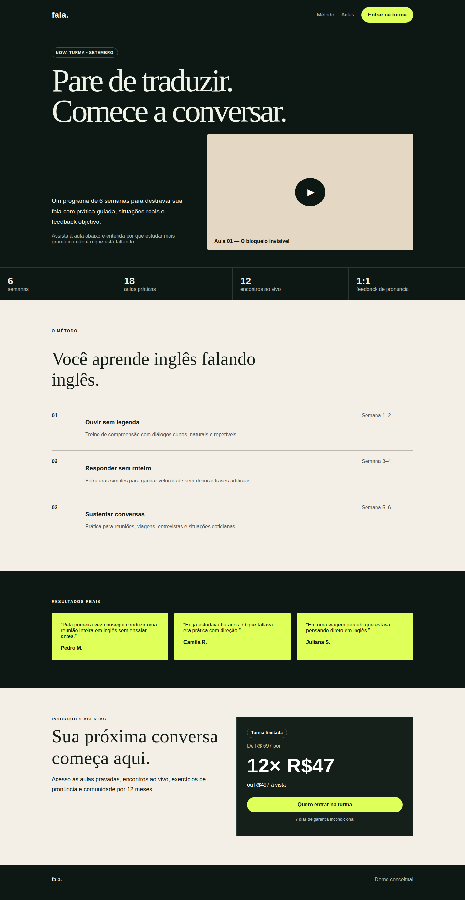

Arquivo: [`examples/vsl-course/index.html`](examples/vsl-course/index.html)

---

### 03 — Clínica Áurea · Saúde / consultório

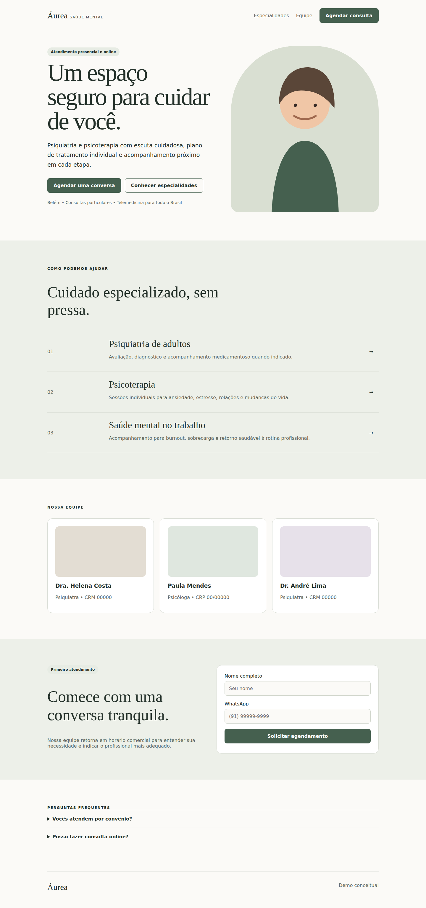

Arquivo: [`examples/healthcare/index.html`](examples/healthcare/index.html)

---

### 04 — Nexa · SaaS B2B

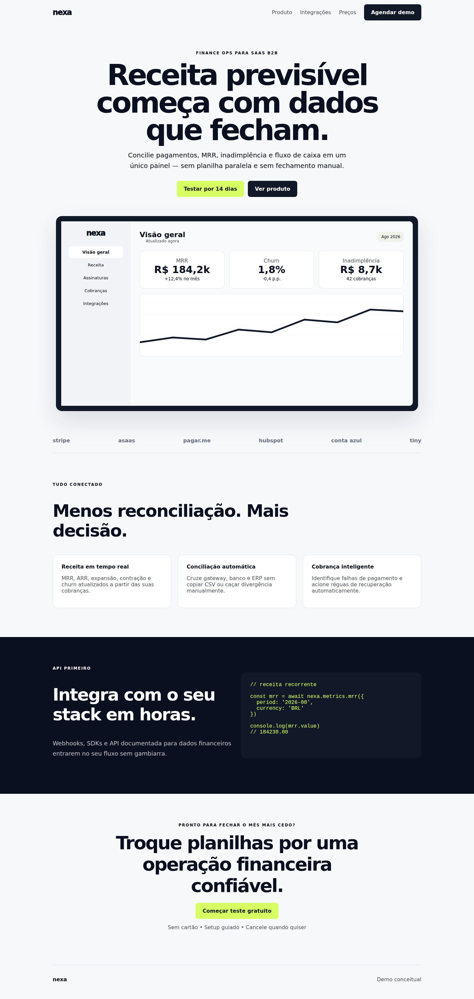

Arquivo: [`examples/saas/index.html`](examples/saas/index.html)

---

### 05 — Moura & Viana · Advocacia

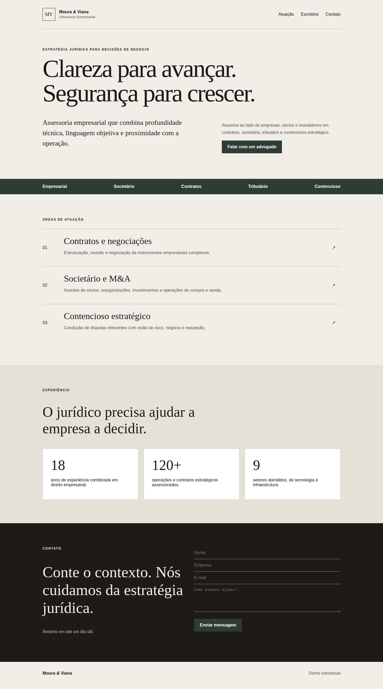

Arquivo: [`examples/law-firm/index.html`](examples/law-firm/index.html)

---

### 06 — Casa Nativa · Imobiliário

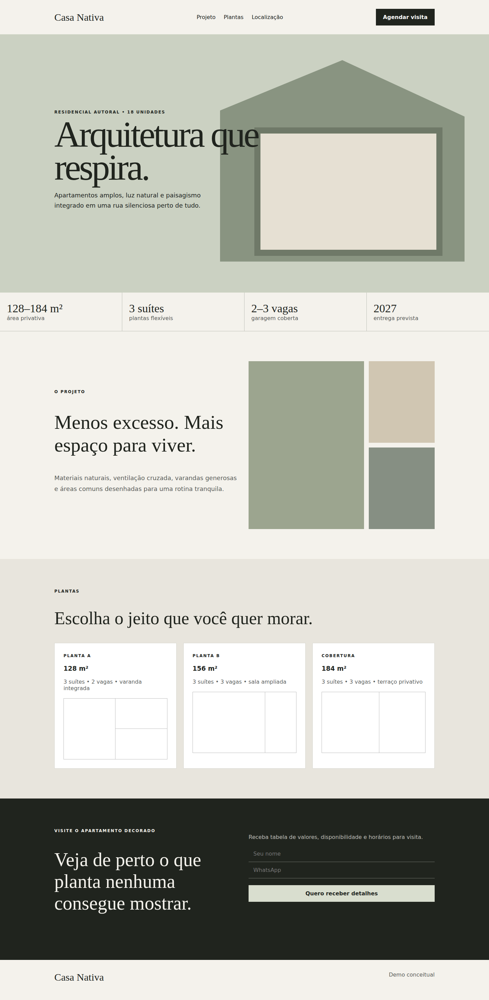

Arquivo: [`examples/real-estate/index.html`](examples/real-estate/index.html)

---

### 07 — Ferro & Sal · Restaurante

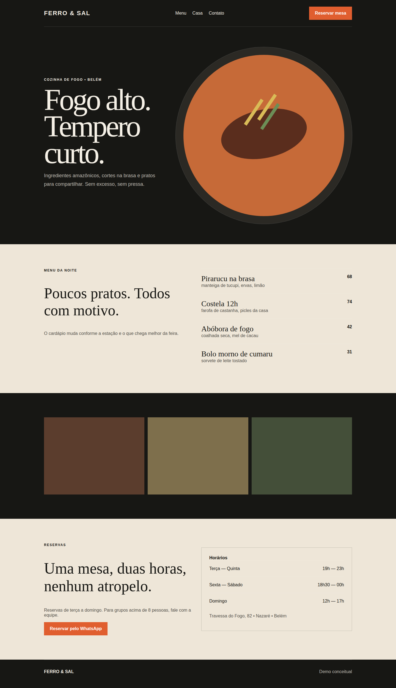

Arquivo: [`examples/restaurant/index.html`](examples/restaurant/index.html)

---

### 08 — Norte Studio · Fitness

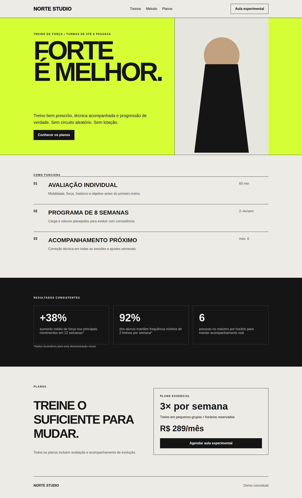

Arquivo: [`examples/fitness/index.html`](examples/fitness/index.html)

---

### 09 — Rua Sete · Agência de marketing

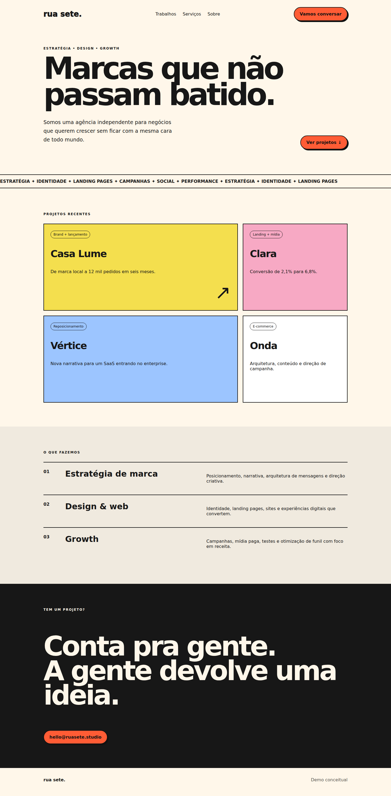

Arquivo: [`examples/marketing-agency/index.html`](examples/marketing-agency/index.html)

---

### 10 — Noma 28 · E-commerce / produto

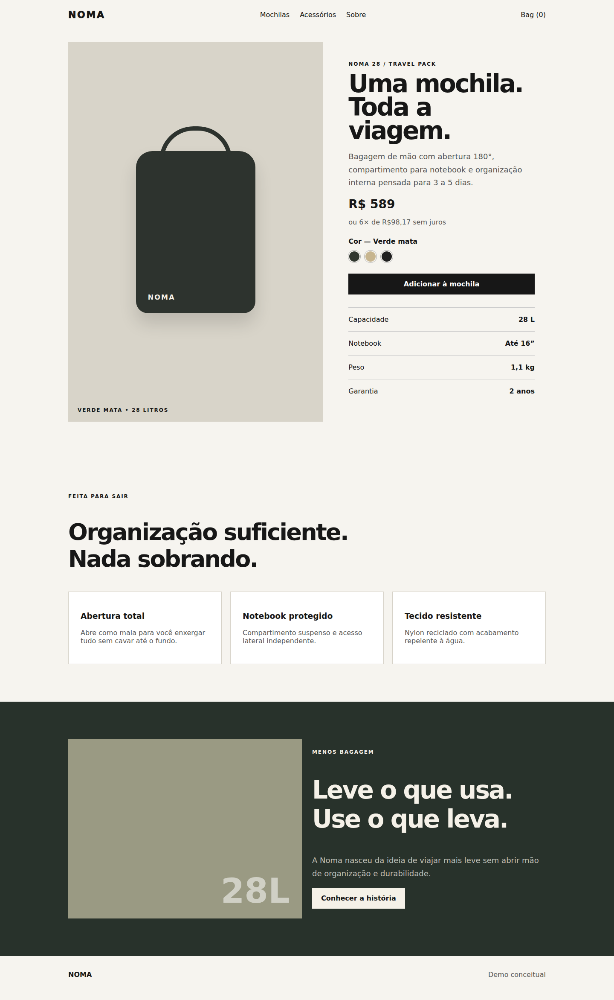

Arquivo: [`examples/ecommerce/index.html`](examples/ecommerce/index.html)

---

### 11 — Ponto 26 · Evento / workshop

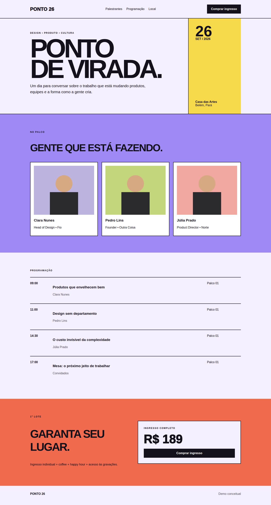

Arquivo: [`examples/event/index.html`](examples/event/index.html)

---

### 12 — Marina Alves · Consultoria / serviço profissional

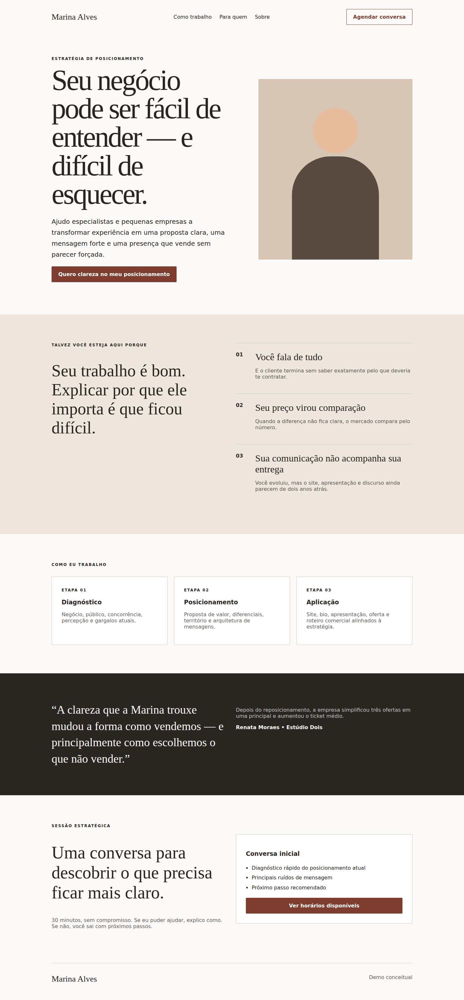

Arquivo: [`examples/consultant/index.html`](examples/consultant/index.html)

## Estrutura

```text
landing-page-showcase/
├── examples/
│   ├── low-ticket/
│   ├── vsl-course/
│   ├── healthcare/
│   ├── saas/
│   ├── law-firm/
│   ├── real-estate/
│   ├── restaurant/
│   ├── fitness/
│   ├── marketing-agency/
│   ├── ecommerce/
│   ├── event/
│   └── consultant/
├── docs/
│   └── screenshots/
├── scripts/
│   └── capture.mjs
├── index.html
└── README.md
```

## Direção de design

Os exemplos foram construídos com foco em:

- identidade visual distinta entre projetos;
- hierarquia tipográfica forte;
- composição editorial e comercial;
- responsividade;
- CTA e leitura orientados à conversão;
- uso contido de efeitos visuais;
- ausência de gradientes decorativos genéricos;
- layouts que possam servir como referência real para projetos freelance.

## Tecnologias

- HTML5
- CSS3
- JavaScript
- layouts responsivos sem dependência de framework

## Como visualizar

Você pode abrir qualquer `index.html` diretamente no navegador ou servir a raiz do projeto localmente:

```bash
python3 -m http.server 4173
```

Depois acesse `http://localhost:4173`.

## Screenshots

Os screenshots deste README são gerados automaticamente em resolução desktop usando Playwright e ficam em `docs/screenshots/`.

---

Desenvolvido por **Lucas Madureira** como vitrine de front-end e landing pages.